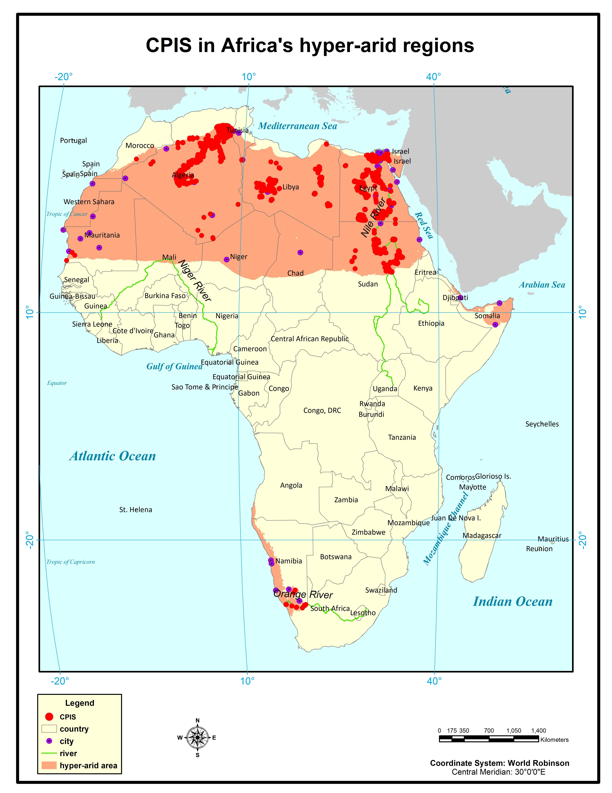

# Annual Center Pivot Irrigation System dataset of Africa’s Hyper-Arid Regions (1972-2025) v1.0

Africa_hyperarid_cpis_1972.zip: CPIS in Africa’s hyperarid areas in 1972 (unzip to obtain the shp file)  
…  
…  
Africa_hyperarid_cpis_2025.zip(z01): CPIS in Africa’s hyperarid areas in 2025 (unzip to obtain the shp file)  

Note that there is no available Landsat satellite data in 1974 and 2012.

  
This dataset is licensed under a Creative Commons Attribution 4.0 International (CC BY 4.0) License.
 
  
Future updates will be implemented. If you use our data, please cite our paper:
 
Chen, F., Shen, P., Van de Voorde, T., Roberts, D., Zhang, Y., Annual Center Pivot Irrigation Expansion in Africa’s Hyper-Arid Regions from 1972 to 2025 (submitted).

For more information, please contact Fen Chen.
